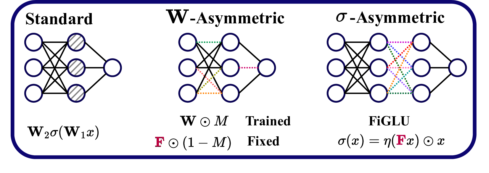

## The Empirical Impact of Neural Parameter Symmetries, or Lack Thereof


by Derek Lim*, Theo (Moe) Putterman*, Robin Walters, Haggai Maron, Stefanie Jegelka. (MIT, UC Berkeley, Northeastern, Techion, NVIDIA, and TU Munich).

[[arXiv](https://arxiv.org/abs/2405.20231)]. To appear at NeurIPS 2024.



Abstract:
*Many algorithms and observed phenomena in deep learning appear to be affected by parameter symmetries -- transformations of neural network parameters that do not change the underlying neural network function. These include linear mode connectivity, model merging, Bayesian neural network inference, metanetworks, and several other characteristics of optimization or loss-landscapes. However, theoretical analysis of the relationship between parameter space symmetries and these phenomena is difficult. In this work, we empirically investigate the impact of neural parameter symmetries by introducing new neural network architectures that have reduced parameter space symmetries. We develop two methods, with some provable guarantees, of modifying standard neural networks to reduce parameter space symmetries. With these new methods, we conduct a comprehensive experimental study consisting of multiple tasks aimed at assessing the effect of removing parameter symmetries. Our experiments reveal several interesting observations on the empirical impact of parameter symmetries; for instance, we observe linear mode connectivity between our networks without alignment of weight spaces, and we find that our networks allow for faster and more effective Bayesian neural network training.*


### Organization

`lmc` contains MLP and ResNet linear mode connectivity (LMC) code

`gnn` contains GNN LMC code

`bnn` contains Bayesian NN code

`metanet` contains code for running metanetworks

`metanet_data` contains code for building datasets of image classifiers, and for testing monotonic linear interpolation (MLI).

## BibTeX citation

Here is the BibTeX citation, which you can use to reference our paper and code:

```bib
@article{lim2024empirical,
  title={The Empirical Impact of Neural Parameter Symmetries, or Lack Thereof},
  author={Lim, Derek and Putterman, Moe and Walters, Robin and Maron, Haggai and Jegelka, Stefanie},
  journal={Advances in neural information processing systems (NeurIPS)},
  year={2024}
}
```
